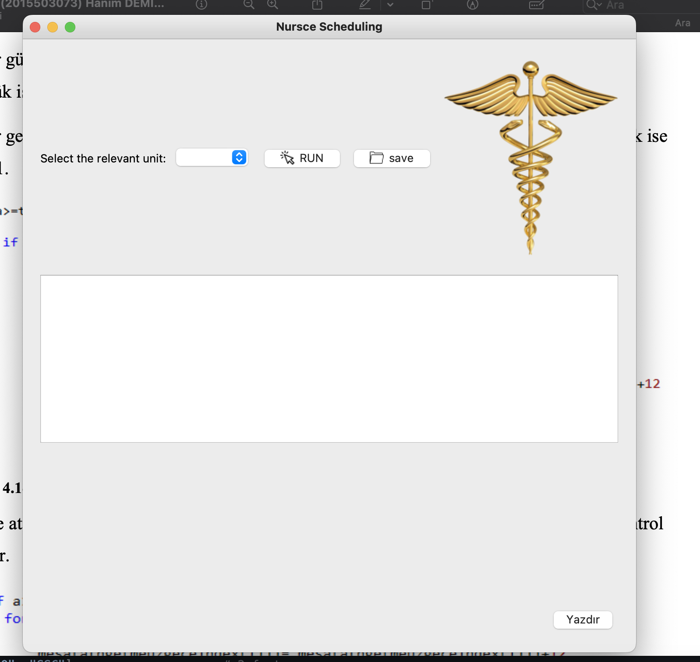
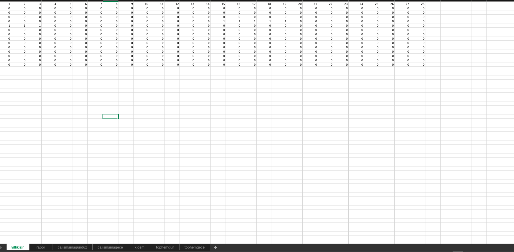
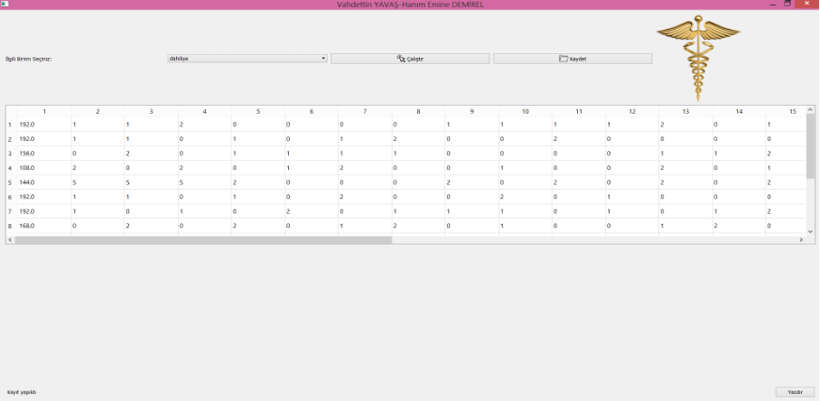

# HEURISTIC ALGORITHM DEVELOPMENT AND INTERFACE DESIGN FOR NURSE SCHEDULING
 

#  SUMMARY 
In this study, the 28-day shift scheduling problem of nurses working in a ward of a hospital is considered. For the solution of the problem, a heuristic algorithm was developed in Python programming language and an interface was designed. The aim of the problem is to reduce the burden of the nurse who prepares the shift schedule, to eliminate human-induced problems and to ensure that all nurses work fairly.
Nurses notify the leaves they request in a 28-day period. The responsible nurse collects these requests in an excel file of the relevant unit and saves them in a folder. When the program runs, the relevant unit is selected from the interface on the screen, the program is run and the schedule is saved. The aim is to reduce the margin of error when preparing scheduling and to save time.

## System Description

In the system, there is a selection button where we can choose the nurses' leave days according to the departments, the button to run the algorithm and the button to save the result.

## An example dataset for the internal medicine section
According to the following excel screenshot model, nurses indicate which days they want to work

The function is defined to reflect the results to the table in the interface.

## The visual of the designed interface is available. The usage of the interface is as follows:

- The unit to be scheduled is selected from the Select the relevant unit section.
- Scheduling is completed by running the program with the Run button.
- The schedule completed with the Save button is saved in the folder.
- The scheduling table created with the Print button is printed on the interface screen.

# Result

The algorithm returns which nurse will be assigned to which shift as a result, as a binary matrix.

